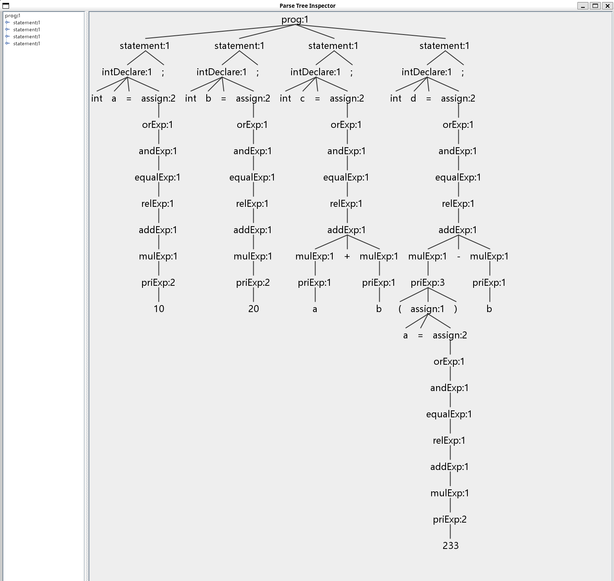

# Antlr4 初步使用

Antlr4是以Java语言编写的，老师的专栏里讲得内容也大多是侧重于Java。

我主要是使用C++语言，所以后续内容主要基于C++。

顺带一提，我已经很多年没在Windows上做过开发了，所以本篇文章的主体内容主要基于 Ubuntu 20.04 LTS。

## 安装

**安装命令行工具**

```bash
pip install antlr4-tools
```

此条命令会安装两个命令行工具：`antlr4`和`antlr4-parse`。

前者用于编译`.g4`词法/语法文件，指定语言后可以生成相应的代码文件（默认Java）。

后者可以很方便的查看词法分析的结果或者查看语法树。

在我本地的环境里，它们被安装到了`~/.local/bin`目录下，需要将该目录添加到环境变量中。

```bash
export PATH=~/.local/bin:$PATH
```

可以在终端中直接执行上述配置，这样会临时生效，也可以将其添加到`~/.bashrc`文件中。

（顺带一提：bash的语法是真的丑）

## 使用

我们准备一个简单的词法文件 `Lexer.g4`，内容在同目录的文件，与专栏不同。是我按照
之前实际的代码里的写法写的。

再准备一个语法文件`Grammar.g4`。因为这俩文件都只是临时使用，所以我也懒得起名字。。。

然后准备一个测试文件`test.txt`。

最后执行：`antlr4-parse Grammar.g4 prog -tokens -tree -gui test.txt`

其中`prog`是我们定义的语法规则的名称，`-tokens`表示输出词法分析的结果，`-tree`表
示输出语法分析的结果，`-gui`表示打开语法树的可视化界面。

这样我们可以看到终端输出了词法分析的结果：

```
[@0,0:2='int',<'int'>,1:0]
[@1,4:4='a',<Identifier>,1:4]
[@2,6:6='=',<'='>,1:6]
[@3,8:9='10',<IntLiteral>,1:8]
[@4,10:10=';',<';'>,1:10]
[@5,12:14='int',<'int'>,2:0]
[@6,16:16='b',<Identifier>,2:4]
[@7,18:18='=',<'='>,2:6]
[@8,20:21='20',<IntLiteral>,2:8]
[@9,22:22=';',<';'>,2:10]
[@10,24:26='int',<'int'>,3:0]
[@11,28:28='c',<Identifier>,3:4]
[@12,30:30='=',<'='>,3:6]
[@13,32:32='a',<Identifier>,3:8]
[@14,34:34='+',<'+'>,3:10]
[@15,36:36='b',<Identifier>,3:12]
[@16,37:37=';',<';'>,3:13]
[@17,39:41='int',<'int'>,4:0]
[@18,43:43='d',<Identifier>,4:4]
[@19,45:45='=',<'='>,4:6]
[@20,47:47='(',<'('>,4:8]
[@21,48:48='a',<Identifier>,4:9]
[@22,50:50='=',<'='>,4:11]
[@23,52:54='233',<IntLiteral>,4:13]
[@24,55:55=')',<')'>,4:16]
[@25,57:57='-',<'-'>,4:18]
[@26,59:59='b',<Identifier>,4:20]
[@27,60:60=';',<';'>,4:21]
[@28,62:61='<EOF>',<EOF>,5:0]
```

以及语法分析的结果：

```
(prog:1 (statement:1 (intDeclare:1 int a = ... # 太长了不展示了
```

同时会弹出一个窗口，显示语法树。



或者我们也可以省略最后的文件名，直接执行：

```bash
antlr4-parse Grammar.g4 prog -tokens -tree -gui
```

此时我们可以手动输入脚本语言的代码，最后输入\<CTRL-D\>（或者是Windows上的\<CTRL-
Z\>）结束输入，看到词法分析和语法分析的结果。

整个过程并没有生成多余的文件，只是在终端和窗口上输出了结果。
