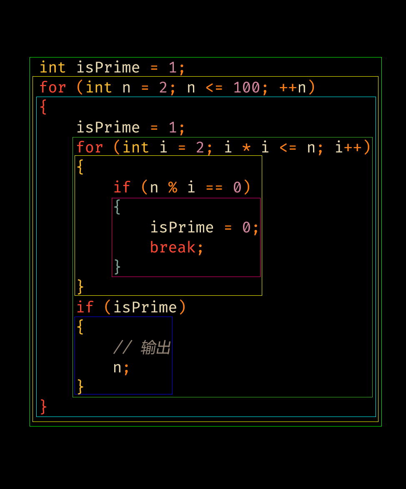

# 作用域

## listener 和 ParseTreeWalker

作用域的分析就需要应用到\*Listener的代码了。

我们需要先继承自 FalconScriptBaseListener 类，实现我们自己的监听器。

再在调用visitor之前，创建一个ParseTreeWalker对象，并传入我们自己的监听器对象。

具体的话可以看看 ./src/main.cc 文件。

## 作用域和栈帧的定义

由于暂时没有函数、类的定义，所以作用域暂时只有全局作用域、各种花括号、for循环。

考虑到 forInit 部分也是可以定义变量的，比如：

```falc
for (int i = 0; i < 233; ++i) {
    // ...
}
```

而且我们希望for循环内部可以用到 i，外面就不让用了，所以要单独定义一个作用域。

对于 ./src/scripts/prime_number.falc 代码，其作用域结构如下



栈帧 StackFrame 的定义暂时比较简单，进入一个新的块作用域，就新建一个栈帧对象，并将其压入栈
中。

每一个栈帧都会存储当前作用域的变量、函数、类等信息。（当然我们暂时只有变量）

退出一个块作用域，就从栈中弹出一个栈帧对象。

作用域的代码：./src/Scope.hpp 。栈帧的代码：./src/StackFrame.hpp 。

在 ./src/MyListener.hpp 文件中，我们完成了作用域结构的划分。

在 ./src/MyVisitor.hpp 文件中，我们在解释执行代码的同时，在进入不同的作用域时，
将其对应的栈帧对象压入栈中。

## repl

对于 repl 的处理，主要在于 visitProg 的时候准备全局作用域，但是运行结束时不要清除。

后续语句直接 visitBlockStatement 就行了。

所以代码上要区分第一次运行和后续运行。
